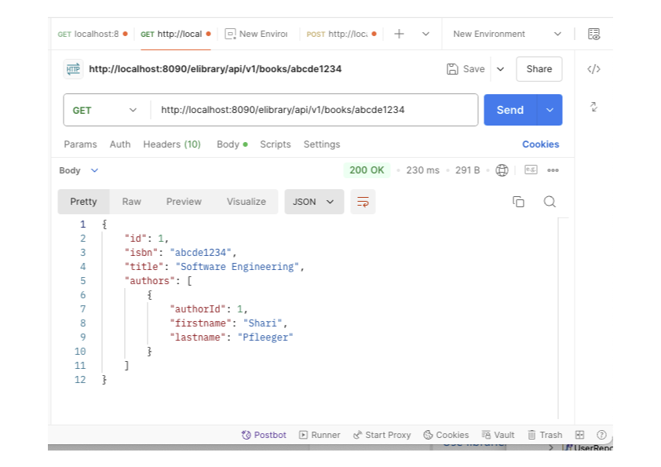

# Lab – Exercise #3: RESTful APIs for eLibrary Web Services

For this lab, you will develop RESTful APIs for the eLibrary Web App.
The REST API should provide the following services:
1.	Produce a list of all the books with their authors (implemented).
2.	Provide details of each book with its author (implemented).
3.	Provide support for creating a book (implemented).
4.	Provide support for updating and deleting a book.
5.	Produce a list of all the authors with the books they published.
6.	Provide details of each author with their published books.
7.	Provide the support for creating and updating an author.

Preambles: Clone the repository `https://github.com/tosdanoye/dat152-lab.git` (if you have not done it before) or update the repository to download the new project.

For the exercises, you will use the [library-spring-ws-rest](library-spring-ws-rest) project. Then, import the maven project into your preferred IDE.
Check the port (server.port) configured in the [application.properties](library-spring-ws-rest/src/main/resources/application.properties) and also familiarise yourself with other configuration properties.

Some ways to run your project:
1.	Run the project from a command prompt (e.g., Mac Terminal). Navigate to the root folder of your project and run the maven command: ./mvnw spring-boot:run
2.	From your IDE: Right click on ‘LibraryApplication.java’ in the “no.hvl.dat152.main” package and “Run As” Java Application.
If everything goes well, your REST api will be available at “http://localhost:8090/elibrary/api/v1” (default server port=8090)
You can change the port and other settings in the ‘application.properties’ file located under “src/main/resources”

## Testing your REST APIs
-	You will need Postman to test your APIs.

-	Alternatively, you can use the ‘curl’ tool/command from a terminal.
`curl -X GET http://localhost:8090/elibrary/api/v1/books`

## Task #1: 

Involves implementing new REST APIs for the Book services. Below APIs have been implemented by default. 
-	getAllBooks -> /books
-	getBook -> /books/{isbn}
-	createBook -> /books

### Your tasks: 

Provide support for updating and deleting a book by ISBN.

BookService
-	Implement 2 methods updateBook(Book book) and deleteByISBN(String isbn) in the BookService class.

BookController
-	Implement 2 methods updateBook and deleteBook in the BookController class.
-	The methods will use the corresponding methods in the BookService class.

## Task #2: 

In the second task, you will provide a complete REST APIs for the Author services. Use inspiration from how the REST APIs in Task #1 are implemented. You will be implementing in 2 classes – AuthorService.java and AuthorController.java

### Your tasks:
-	Produce the list of all the authors with their published books.
-	Provide details of each author with their published books.
-	Provide support for creating and updating an author.

### Additional challenge (optional)

Implement the APIs for the User-Book model. This means, you will write the 3 parts: Persistence, Service, and Controller.

#### Persistence Layer
- Implement the User model (entity) based on the ER model in the slides
- Implement the Order model (entity) based on the ER model in the lecture slides

#### Services and Controllers

Write the service and controller methods to provide the following:
- Provide support for creating, updating and deleting library users.
- Produce a list of all the library users. 
- Provide details of each library user.
- Provide support for users to order and return books.
- Produce a list of all books ordered (borrowed) by a user.

Controller methods (examples)
- createUser
- updateUser
- deleteUser
- getUsers
- getUser
- borrowBook
- returnBook 
